<div align="center">

# 🗄️ Database Schema — Entity Relationship Diagram

Full ERD documentation for the **Wellness Booking** system.

**60+ models** · **PostgreSQL 16** · **Prisma ORM**

[← Back to main README](../README.md)

</div>

---

## 📑 Table of Contents

- [Overview](#-overview)
- [ERD — Geography & University](#-geography--university)
- [ERD — Accounts & Authorization](#-accounts--authorization)
- [ERD — Students](#-students)
- [ERD — Consultants & Organizations](#-consultants--organizations)
- [ERD — Booking Core](#-booking-core)
- [ERD — Booking Lifecycle](#-booking-lifecycle)
- [ERD — Feedback & Evaluation](#-feedback--evaluation)
- [ERD — Points & Discipline](#-points--discipline)
- [ERD — Consultant Borrowing](#-consultant-borrowing)
- [ERD — AI Knowledge Base](#-ai-knowledge-base)
- [ERD — Academic Calendar](#-academic-calendar)
- [ERD — Reference / Category Tables](#-reference--category-tables)
- [Full System ERD](#-full-system-erd)
- [Enums](#-enums)

---

## 🔭 Overview

The database is organized into **11 domains** with the following model counts:

| Domain | Models | Description |
|---|---|---|
| Geography & University | 4 | Region, Province, University, UniversityConnection |
| Accounts & Auth | 3 | Account, AccountRoleCategory, AccountUniversityPermission |
| Students | 8 | Student, Profile, Academic, Address, BehaviorStatus, PointWallet, etc. |
| Consultants | 6 | Consultant, Profile, Language, Specialization, ShiftTeam, Organization |
| Booking Core | 5 | Booking, TimeSlot, DayPeriod, BookingAssignment, BookingSession |
| Booking Lifecycle | 5 | Attendance, Outcome, Cancellation, AgreementSignature, ExceptionRequest |
| Feedback | 4 | Feedback, FeedbackRating, FeedbackComment, EvaluationCriterion |
| Points & Discipline | 4 | PointRule, PointTransaction, PointWallet, DisciplineLog |
| Consultant Borrowing | 4 | BorrowRequest, BorrowAssignment, BorrowAvailability, BorrowPolicy |
| AI Knowledge Base | 5 | KbDocument, KbDocumentVersion, KbChunk, KbDocumentRole, AiFeedbackEvent |
| Academic Calendar | 3 | AcademicTerm, AcademicPeriod, Season |
| Reference Tables | 15+ | GenderCategory, BloodGroupCategory, ServiceModeCategory, etc. |

---

## 🌍 Geography & University

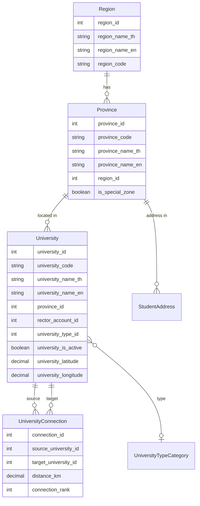

---

## 🔐 Accounts & Authorization

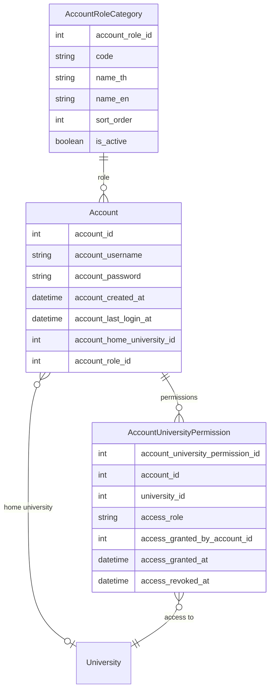

---

## 🎓 Students

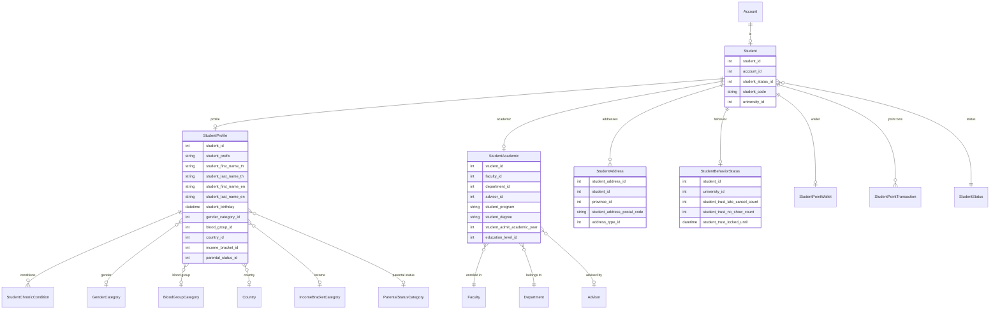

---

## 👨‍⚕️ Consultants & Organizations

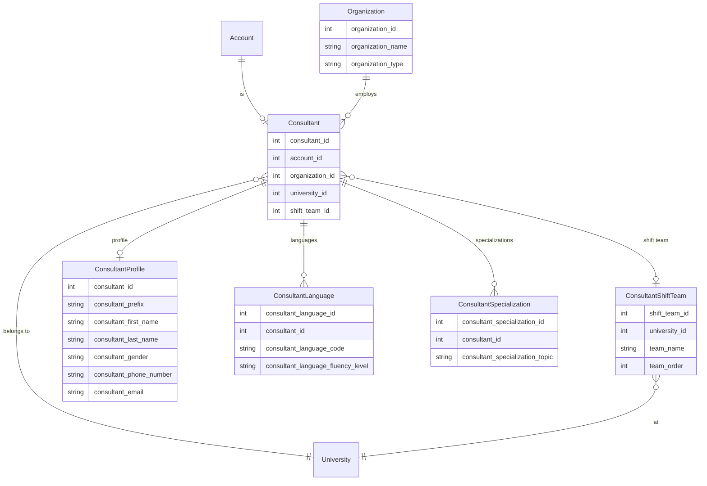

---

## 📋 Booking Core

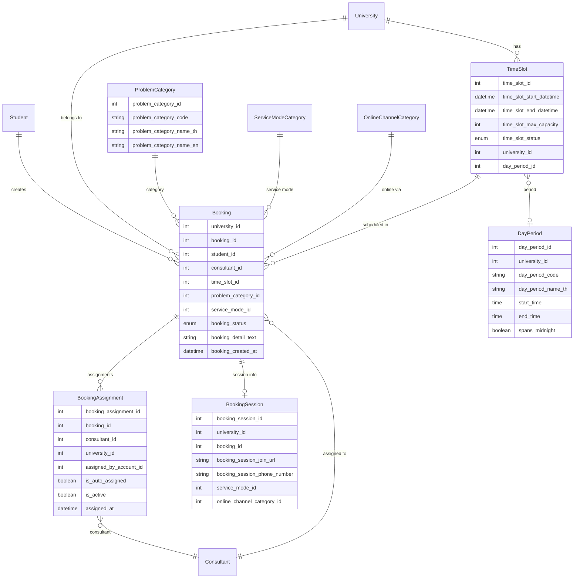

---

## 🔄 Booking Lifecycle

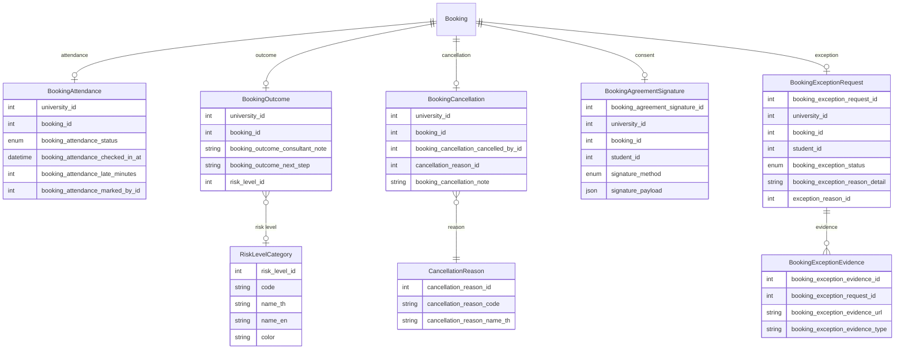

---

## ⭐ Feedback & Evaluation

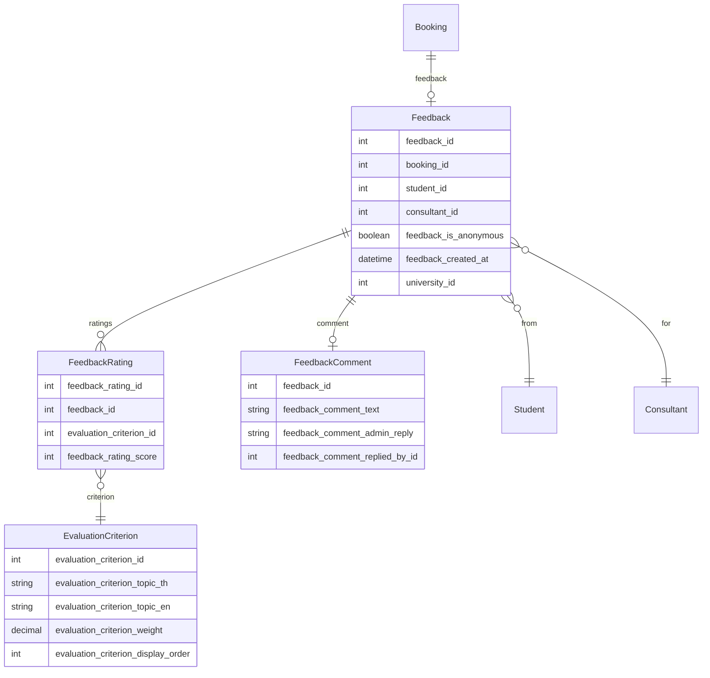

---

## 🏅 Points & Discipline

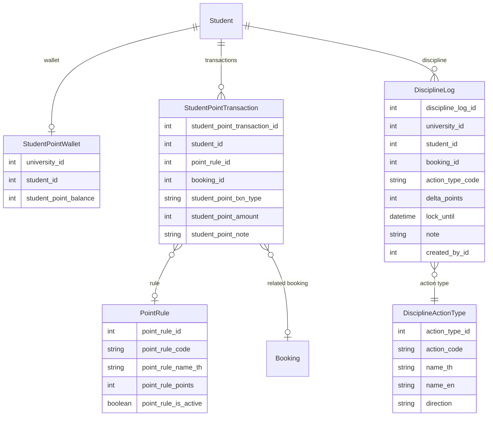

---

## 🔄 Consultant Borrowing

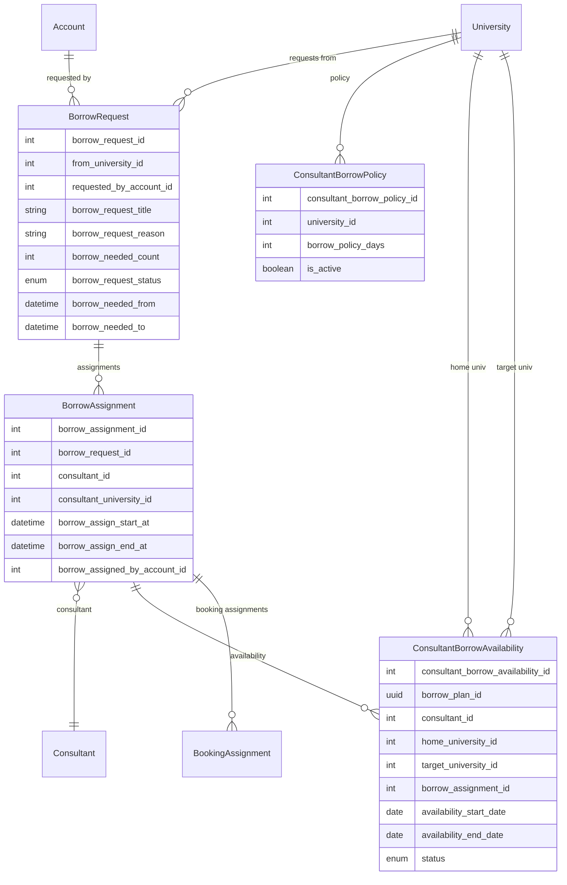

---

## 🤖 AI Knowledge Base

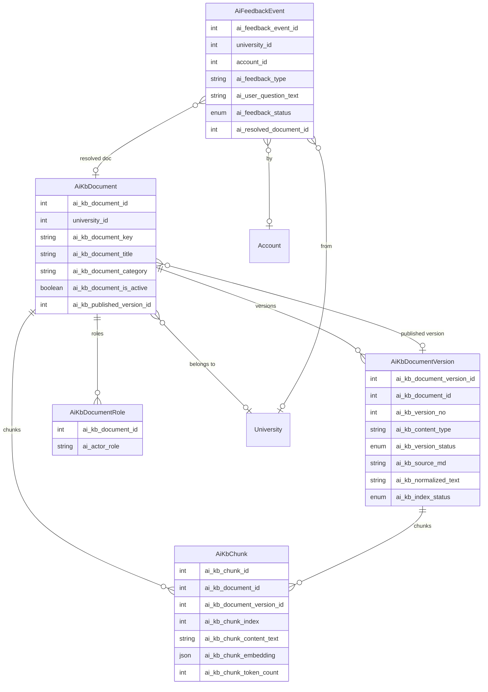

---

## 📅 Academic Calendar

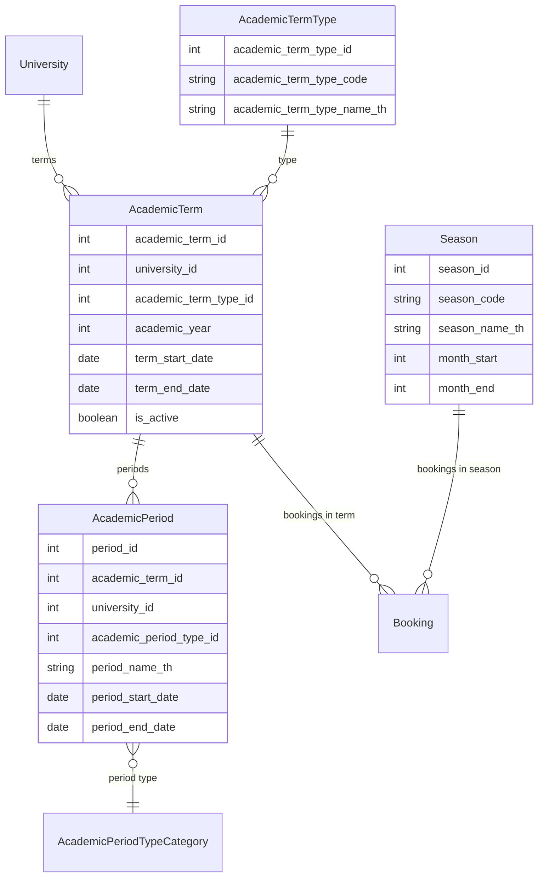

---

## 📚 Reference / Category Tables

All category/reference tables follow a consistent schema pattern:

```
{category_name}_category (
    {name}_id          INT    PRIMARY KEY
    code               VARCHAR(30)  UNIQUE
    name_th            VARCHAR(100)
    name_en            VARCHAR(100)
    sort_order         INT    DEFAULT 0
    is_active          BOOLEAN DEFAULT true
)
```

| Table | Used By |
|---|---|
| `AccountRoleCategory` | `Account.account_role_id` |
| `StudentStatus` | `Student.student_status_id` |
| `GenderCategory` | `StudentProfile.gender_category_id` |
| `BloodGroupCategory` | `StudentProfile.blood_group_id` |
| `IncomeBracketCategory` | `StudentProfile.income_bracket_id` |
| `ParentalStatusCategory` | `StudentProfile.parental_status_id` |
| `EducationLevelCategory` | `StudentAcademic.education_level_id` |
| `AddressTypeCategory` | `StudentAddress.address_type_id` |
| `NationalityTypeCategory` | `Country.nationality_type_id` |
| `UniversityTypeCategory` | `University.university_type_id` |
| `ServiceModeCategory` | `Booking.service_mode_id`, `BookingSession.service_mode_id` |
| `OnlineChannelCategory` | `Booking.online_channel_category_id` |
| `ProblemCategory` | `Booking.problem_category_id` |
| `CancellationReason` | `BookingCancellation.cancellation_reason_id` |
| `ExceptionReason` | `BookingExceptionRequest.exception_reason_id` |
| `RiskLevelCategory` | `BookingOutcome.risk_level_id` |
| `EvaluationCriterion` | `FeedbackRating.evaluation_criterion_id` |
| `DisciplineActionType` | `DisciplineLog.action_type_code` |
| `AcademicTermType` | `AcademicTerm.academic_term_type_id` |
| `AcademicPeriodTypeCategory` | `AcademicPeriod.academic_period_type_id` |
| `SubjectGroupCategory` | `Faculty.subject_group_category_id` |
| `ChronicConditionCategory` | `StudentChronicCondition.condition_category_id` |
| `NotificationTemplate` | `Notification.notification_template_id` |

---

## 🌐 Full System ERD

> This diagram shows all major entities and their relationships across the entire system.

```mermaid
erDiagram
    %% ── Geography ──
    Region ||--o{ Province : ""
    Province ||--o{ University : ""

    %% ── University Hierarchy ──
    University ||--o{ Faculty : ""
    Faculty ||--o{ Department : ""
    Department ||--o{ Advisor : ""

    %% ── Accounts ──
    AccountRoleCategory ||--o{ Account : ""
    Account }o--o| University : "home"
    Account ||--o| Student : ""
    Account ||--o| Consultant : ""
    Account ||--o| Advisor : ""

    %% ── Students ──
    Student ||--o| StudentProfile : ""
    Student ||--o| StudentAcademic : ""
    Student ||--o{ StudentAddress : ""
    Student ||--o| StudentBehaviorStatus : ""
    Student ||--o| StudentPointWallet : ""

    %% ── Consultants ──
    Organization ||--o{ Consultant : ""
    Consultant }o--o| ConsultantShiftTeam : ""
    Consultant ||--o| ConsultantProfile : ""

    %% ── Bookings ──
    University ||--o{ TimeSlot : ""
    University ||--o{ Booking : ""
    Student ||--o{ Booking : ""
    Consultant ||--o{ Booking : ""
    TimeSlot ||--o{ Booking : ""
    ProblemCategory ||--o{ Booking : ""

    %% ── Booking Lifecycle ──
    Booking ||--o{ BookingAssignment : ""
    Booking ||--o| BookingSession : ""
    Booking ||--o| BookingAttendance : ""
    Booking ||--o| BookingOutcome : ""
    Booking ||--o| BookingCancellation : ""
    Booking ||--o| BookingAgreementSignature : ""
    Booking ||--o| BookingExceptionRequest : ""
    Booking ||--o| Feedback : ""

    %% ── Feedback ──
    Feedback ||--o{ FeedbackRating : ""
    Feedback ||--o| FeedbackComment : ""

    %% ── Points & Discipline ──
    Student ||--o{ StudentPointTransaction : ""
    Student ||--o{ DisciplineLog : ""
    PointRule ||--o{ StudentPointTransaction : ""

    %% ── Borrowing ──
    University ||--o{ BorrowRequest : ""
    BorrowRequest ||--o{ BorrowAssignment : ""
    BorrowAssignment ||--o{ ConsultantBorrowAvailability : ""
    Consultant ||--o{ BorrowAssignment : ""

    %% ── AI KB ──
    AiKbDocument ||--o{ AiKbDocumentVersion : ""
    AiKbDocument ||--o{ AiKbChunk : ""

    %% ── Academic ──
    University ||--o{ AcademicTerm : ""
    AcademicTerm ||--o{ AcademicPeriod : ""

    %% ── Notifications ──
    Account ||--o{ Notification : ""
    NotificationTemplate ||--o{ Notification : ""
```

---

## 🏷️ Enums

| Enum | Values |
|---|---|
| `BookingStatus` | `PENDING_ASSIGNMENT`, `ASSIGNED`, `IN_PROGRESS`, `COMPLETED`, `CANCELLED` |
| `TimeSlotStatus` | `OPEN`, `CLOSED`, `CANCELLED`, `FULL` |
| `AttendanceStatus` | `PENDING`, `CHECKED_IN`, `LATE`, `NO_SHOW`, `CANCELLED_BY_CONSULTANT` |
| `ExceptionStatus` | `DRAFT`, `PENDING_REVIEW`, `APPROVED`, `REJECTED` |
| `BorrowRequestStatus` | `DRAFT`, `SUBMITTED`, `APPROVED`, `REJECTED`, `ASSIGNED`, `COMPLETED`, `CANCELLED` |
| `BorrowAvailabilityStatus` | `ACTIVE`, `COMPLETED`, `CANCELLED` |
| `KbVersionStatus` | `DRAFT`, `PUBLISHED`, `ARCHIVED` |
| `KbIndexStatus` | `PENDING`, `READY`, `FAILED` |
| `AiFeedbackStatus` | `OPEN`, `RESOLVED`, `IGNORED` |
| `ConsentSignatureMethod` | `DRAW` |

---

<div align="center">

📌 **Schema source:** [`schema.prisma`](./schema.prisma) (1500+ lines)

[← Back to main README](../README.md)

</div>
